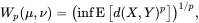
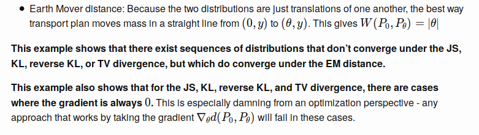

# [Wasserstein GAN](https://arxiv.org/abs/1701.07875)

## Tensorflow Implementation using MNIST

You can find the Tensorflow implementation of WassersteinGan paper in [WGAN.ipynb](https://github.com/Mohammad-Rahmdel/WassersteinGAN-Tensorflow-/blob/master/WGAN.ipynb).

### Networks:

**Generator** <br>
```
	model.add(Dense(128 * 7 * 7, kernel_initializer=init, input_dim=latent_dim))
	model.add(LeakyReLU(alpha=0.2))
	model.add(Reshape((7, 7, 128)))
	model.add(Conv2DTranspose(128, (4,4), strides=(2,2), padding='same', kernel_initializer=init))
	model.add(BatchNormalization())
	model.add(LeakyReLU(alpha=0.2))
	model.add(Conv2DTranspose(128, (4,4), strides=(2,2), padding='same', kernel_initializer=init))
	model.add(BatchNormalization())
	model.add(LeakyReLU(alpha=0.2))
	model.add(Conv2D(1, (7,7), activation='tanh', padding='same', kernel_initializer=init))
```

**Critic** <br>
```
    model.add(Conv2D(64, (4,4), strides=(2,2), padding='same', kernel_initializer=init, input_shape=in_shape))
	model.add(BatchNormalization())
	model.add(LeakyReLU(alpha=0.2))
	model.add(Conv2D(64, (4,4), strides=(2,2), padding='same', kernel_initializer=init, kernel_constraint=const))
	model.add(BatchNormalization()) 
	model.add(LeakyReLU(alpha=0.2))
	model.add(Flatten())
	model.add(Dense(1)) 
```

In Critic's last dense layer there is no activation function(sigmoid). Therefore, its output value is not limited unlike discriminator which predicts the probability of its inputs as being fake or real. That's why the author called this network *critic* instead of discriminator!

## Results

<table align='center'>
 <tr align='center'>
<td> only 3 </td>
<td> only 4 </td>
</tr>
<tr align='center'>
<td> 
<td> 
</tr>
<tr align='center'>
<td> MNIST generation </td>
<td> MNIST generation </td>
</tr>
<tr>
<td> 
<td> 
</tr>
</table>


<p align="center">
    Generated samples during training (Trained on 3 digit samples)
</p>
<table align='center'>
<tr align='center'>
<td> epoch 100  </td>
<td> epoch 1500  </td>
</tr>	
<tr align='center'>
<td> 
<td> 
</tr>
<tr align='center'>	
<td> epoch 3500  </td>
<td> Loss </td>
</tr>
<tr align='center'>
<td> 
<td> 
</tr>
</table>


<p align="center">
    Generator's outputs after 8000 epochs (Trained on 6 digit samples)
</p>
<p align="center">
    
</p>

You can find more generated samples [here](https://github.com/Mohammad-Rahmdel/WassersteinGAN-Tensorflow-/blob/master/results).


# Wasserstein

In statistics, the **earth mover's distance (EMD)** is a measure of the distance between two probability distributions over a region D. Informally, if the distributions are interpreted as two different ways of piling up a certain amount of dirt over the region D, the EMD is the minimum cost of turning one pile into the other; where the cost is assumed to be the amount of dirt moved times the distance by which it is moved. Calculating the EMD is in itself an optimization problem. There are infinitely many ways to move the earth around, and we need to find the optimal one.

The EMD is widely used in content-based image retrieval to compute distances between the color histograms of two digital images. In this case, the region is the RGB color cube, and each image pixel is a parcel of "dirt". The same technique can be used for any other quantitative pixel attribute, such as luminance, gradient, apparent motion in a video frame, etc.. <br>
In computer science, this metric is widely used to compare discrete distributions, e.g. the color histograms of two digital images. [Here](https://github.com/Mohammad-Rahmdel/WassersteinGAN-Tensorflow-/blob/master/Earth%20Mover's%20Distance.ipynb) are some examples of EMD that help for better understanding.


In mathematics, EMD is known as **Wasserstein** metric. The **Wasserstein** or Kantorovich–Rubinstein metric or distance is a distance function defined between probability distributions on a given metric space M. 


The  Wasserstein distance between two probability measures μ and ν in  is defined as: <br>

where  denotes the collection of all measures on M × M with marginals μ and ν on the first and second factors respectively. <br>

The Wasserstein metric may be equivalently defined by: 

where E[Z] denotes the expected value of a random variable Z and the infimum is taken over all joint distributions of the random variables X and Y with marginals μ and ν respectively and d is a metric. 


For p=1, it is proven that the Wasserstein-1 metric in 1D (dimension one), between two cumulative distribution functions(CDF) F1 and F2 on R can be written as the L1 distance: <br>
 <br>


In Wasserstein GAN paper, Arjovsky et al use the **Wasserstein-1** metric as a way to improve the original framework of Generative Adversarial Networks (GAN), to alleviate the vanishing gradient and the mode collapse issues. 


## WGAN (Wasserstein Generative Adversarial Networks)

### Introduction
Training GAN is hard. Models may never converge and mode collapses are common. <br>

When learning generative models, we assume the data we have comes from some unknown distribution . (The r stands for real) We want to learn a distribution ​​ that approximates , where θ are the parameters of the distribution. <br>
You can imagine two approaches for doing this. <br>
- Directly learn the probability density function ​​. We optimize ​​ through maximum likelihood estimation.

- Learn a function that transforms an existing distribution Z into ​​.


The first approach runs into problems. Given function ​​​​, the MLE objective is <br>
​​ <br>
In the limit, this is equivalent to minimizing the KL-divergence. <br>
​​ <br>
​​ <br>

Variational Auto-Encoders (VAEs) and Generative Adversarial Networks (GANs) are well known examples of this approach.

### Different Distances
​​ <br>


The paper introduces a simple example to argue why we should care about the Earth-Mover distance.

​​ <br>
​​ <br>
​​ <br>


After this example, the paper provides some theorems, using them we can conclude that 
**every distribution that converges under the KL, reverse-KL, TV, and JS divergences also converges under the Wasserstein divergence**. It also proves that a small earth mover distance corresponds to a small difference in distributions. Combined, this shows the Wasserstein distance is a compelling loss function for generative models.

Unfortunately, computing the Wasserstein distance exactly is intractable. <br>
​​ <br>

The paper shows how we can compute an approximation of this.
A result from Kantorovich-Rubinstein duality shows W is equivalent to:
​​ <br>
where the supremum is taken over all 1-Lipschitz functions.


#### Lipschitz Constraint 
**f is called k-Lipschitz if |f(x) - f(y)| <= k.|| x-y || for all x, y.** <br>


The Wasserstein distance is **the minimum cost of transporting mass in converting the data distribution q to the data distribution p**. The Wasserstein distance for the real data distribution Pr and the generated data distribution Pg is mathematically defined as the greatest lower bound (infimum) for any transport plan (i.e. the cost for the cheapest plan): <br>
 <br>
Π(Pr, Pg) denotes the set of all joint distributions γ(x, y) whose marginals are respectively Pr and Pg.


Let’s look at the two common divergences used in generative models first, namely the KL-Divergence and the JS-Divergence where p is the real data distribution and q is the one estimated from the model. Let’s assume they are Gaussian distributed. In the diagram below, we plot p and a few q having different means. <br>
 <br>

Below, we plot the corresponding KL-divergence and JS-divergence between p and q with means ranging from 0 to 35. As anticipated, when both p and q are the same, the divergence is 0. As the mean of q increases, the divergence increases. The gradient of the divergency will eventually diminish. We have close to a zero gradient, i.e. the generator learns nothing from the gradient descent. <br>
 <br>
Minimizing the GAN objective function with an optimal discriminator is equivalent to minimizing the JS-divergence. As illustrated above, if the generated image has distribution q far away from the ground truth p, the generator barely learns anything.


### GAN vs WGAN

#### GAN
 <br>
#### WGAN
 <br>

The network design is almost the same except the critic does not have an output sigmoid function. The major difference is only on the cost function: <br>
 <br>

However, there is one major thing missing. f has to be a 1-Lipschitz function. To enforce the constraint, WGAN applies a very simple clipping to restrict the maximum weight value in f, i.e. the weights of the discriminator must be within a certain range controlled by the hyperparameters c. <br>
 <br>

### Algorithm
Now we can put everything together in the pseudo-code below. <br>
 <br>

## Experiments
### Correlation between loss metric and image quality
In GAN, the loss measures how well it fools the discriminator rather than a measure of the image quality. As shown below, the generator loss in GAN does not drop even the image quality improves. Hence, we cannot tell the progress from its value. We need to save the testing images and evaluate them visually. On the contrary, WGAN loss function reflects the image quality which is more desirable. <br>
 <br>

### Improve training stability
Two significant contributions for WGAN are: <br>
- it has no sign of mode collapse in experiments, and
- the generator can still learn when the critic performs well. 

 <br>


## Implementation

Instead of using a discriminator to classify or predict the probability of generated images as being real or fake, the WGAN changes or replaces the discriminator model with a critic that scores the realness or fakeness of a given image.


This change is motivated by a theoretical argument that training the generator should seek a minimization of the distance between the distribution of the data observed in the training dataset and the distribution observed in generated examples.


The benefit of the WGAN is that the training process is more stable and less sensitive to model architecture and choice of hyperparameter configurations. Perhaps most importantly, the loss of the discriminator appears to relate to the quality of images created by the generator.


The differences in implementation for the WGAN are as follows:

**1. Use a linear activation function in the output layer of the critic model (instead of sigmoid).**

  - The DCGAN uses the sigmoid activation function in the output layer of the discriminator to predict the likelihood of a given image being real.
  - In the WGAN, the critic model requires a linear activation to predict the score of “realness” for a given image.

**2. Use (-1) labels for real images and 1 labels for fake images (instead of 1 and 0).**

  - The DCGAN uses class 0 for fake images and class 1 for real images, and these class labels are used to train the GAN.

  - In the DCGAN, these are precise labels that the discriminator is expected to achieve. The WGAN does not have precise labels for the critic. Instead, it encourages the critic to output scores that are different for real and fake images.

  - This is achieved via the Wasserstein function that cleverly makes use of positive and negative class labels.

**3. Use Wasserstein loss to train the critic and generator models.**

  - The DCGAN trains the discriminator as a binary classification model to predict the probability that a given image is real.

  - To train this model, the discriminator is optimized using the binary Cross-Entropy loss function. The same loss function is used to update the generator model.

  - The primary contribution of the WGAN model is the use of a new loss function that encourages the discriminator to predict a score of how real or fake a given input looks. This transforms the role of the discriminator from a classifier into a critic for scoring the realness or fakeness of images, where the difference between the scores is as large as possible.

  - We can implement the Wasserstein loss as a custom function in Keras that calculates the average score for real or fake images.

  - The score is maximizing for real examples and minimizing for fake examples. Given that stochastic gradient descent is a minimization algorithm, we can multiply the class label by the mean score (e.g. -1 for real and 1 for fake which as no effect), which ensures that the loss for real and fake images is minimizing to the network.


**4. Constrain critic model weights to a limited range after each mini batch update.**

**5. Update the critic model more times than the generator each iteration.**

**6. Use the RMSProp version of gradient descent with a small learning rate and no momentum.**


## References
[1] https://arxiv.org/abs/1701.07875 <br>
[2] https://en.wikipedia.org/wiki/Earth_mover%27s_distance <br>
[3] https://en.wikipedia.org/wiki/Wasserstein_metric <br>
[4] https://machinelearningmastery.com/how-to-code-a-wasserstein-generative-adversarial-network-wgan-from-scratch/ <br>
[5] https://www.alexirpan.com/2017/02/22/wasserstein-gan.html 


